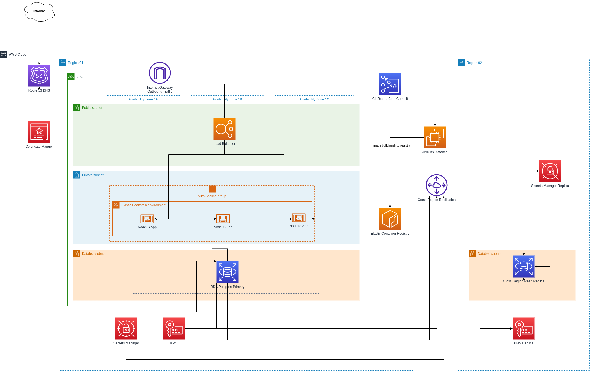

# Table of Contents
[The Proposed Architecture](#the-proposed-architecture)<br>
[VPC](#vpc)<br>
[Security and Compliance](#security-and-compliance)<br>
[Elastic Beanstalk](#elastic-beanstalk)<br>
[PSQL RDS](#psql-rds)<br>
[]()<br>

## The Proposed Architecture

Below you will find a [diagram](#diagram01) of the proposed architecture for a highly redundand and highly available Web Application.<br>
The ides is to provide redundancy both with the web application and with the backed database. <br>
The NodeJS application is containerized, static and able to scale with load. As such I feel like the database is the primary concern as for a disaster recovery situation. <br>

### Data Flow
1. User initiates a session to wwww.yourdomain.com
2. DNS resolution happens agains Route53 in AWS, domain certificate is signed by teh Certificate Manager
3. 

###### diagram.01


## Infrastructure Cost Estimate

## VPC

We have 3 tiers of subnets accross 3 availibility zones in a single region.<br>
With an additional possibility to deploy a secondary VPC in another region. <br>
The CloudFormatiom stack for the VPC creation can be found in the `cloudFormationStacks` folder in the [1-vpc.yaml](./../cloudFormationStacks/1-vpc.yaml) file.<br>
It creates all the necessary Subnets, route tables, Internet gateway, and route table association. 

### Cross Region VPC

This VPC stack has the ability to deploy a cross region by setting the `DisasterRecovery` parameter to `yes`.<br>
The parameter is then evaluated in the `Condition` block and if it sets DisasterRecovery additional resources with the matched Conditon will be deployed in this and other stacks.<br>

```yaml
...
Paremeter:
  DisasterRecovery:
    Type: String
    AllowedValues: [yes, no]
    Default: no
...
Conditions:
  DisasterRecovery: !Equals [!Ref DisasterRecovery, yes]
  NoDisasterRecovery: !Equals [!Ref DisasterRecovery, no]
```
By default the cross region VPC is set to `no` and id evaluated as `NoDisasterRecovery` hence additional resources will **not** to be created. <br>
Only then when the Condition is Evaluated and set to `DisasterRecovery` will the additional VPC and subnets with the condition statement be created. <br>

```yaml
...
Resources:
  VPC2:
    Type: "AWS::EC2::VPC"
    Condition: DisasterRecovery 
    Properties:
      CidrBlock: !Ref VpcCIDR2
      EnableDnsHostnames: true
      EnableDnsSupport: true
      Tags:
        - Key: Name
          Value: !Ref VpcName
...
Output:
  DisasterRecovery:
    Description: Create Cross region RDS
    Value: !Ref DisasterRecovery
    Export: 
      Name: DisasterRecovery
```
The above value is exported in CloudFormation so that susequent stacks are able to fetch the same value and deploy their disaster recovery stacks accordingly.

Subnets are arranged as the following in the main VCP.

###### table.01
| Subnet Tier | Purpose | IP Range |
|-------------|---------|----------|
| VPC   |   | `10.0.0.0/16` |
| `public` | hosts the BeanStalk load balancer | `10.0.1.0/24` - `10.0.3.0/24` | 
| `private`| hosts the BeanStalk web application | `10.0.4.0/24` - `10.0.6.0/24` | 
| `database`| used by the RDS subnet group | `10.0.7.0/24` - `10.0.9.0/24` |

<br>
When DisasterRecovery is enabled the secondary region VPC has the following IP values.

###### table.02
| Subnet Tier | Purpose | IP Range |
|-------------|---------|----------|
| VPC   |   | `10.10.0.0/16` |
| `public` | hosts the BeanStalk load balancer | `10.10.1.0/24` | 
| `private`| hosts the BeanStalk web application | `10.10.2.0/24` | 
| `database`| used by the RDS subnet group | `10.10.3.0/24` |

## Elastic Beanstalk


## PSQL RDS

It is my assumption that the RDS instance is the primary data store for the application and that only logic is handled by the web application. 

In addition to to this I only opted to use a single RDS instance. There may be a neccessati to implement an additional reporting, or read replica in the primary Region.
These may be necessary to drive reporting and other insights into the data. 

When the value of `DisasterRecovery` set to `yes`, the CloudFormation template creates a cross region RDS PSQL read replica, KMS replica, and Secrets replica.
The `KMS` key is use to encrypt RDS data at rest.

The public tier hosts the load balancer and 
If the company chooses 

`Route 53` handles the DNS entries and mapping to the Elastic Beanstalk IP Load Balancer.<br>
The `Certificate Manager` handles the https certificates for the DNS zone required to acept encrypted web traffic destined for the Web Application.<br>

## Security and Compliance

Deploying a Content Delivery Network such as `CloudFront` to limit where the traffic comes from is highly advisable. <br>
By setting the `PriceClass` in the CDN we can also enable caching for the website, and to further security we can enable geo restrictions. <br>
CloudFront provides multiple features to mitigate DDoS (Distributed Denial of Service) attacks, which are an increasingly common threat to web applications.<br>

Security group in the `private` subnets will only allow inboud traffic from the public subnets, specifically where the load balancer lives. <br>
In addition to this the security group in the `databse` subnets only allow inbound traffic from `10.0.4.0/22` which covers only private subnets. <br> 
Data in RDS is encrypted at rest using a KMS key which when `DisasterRecovery` is enabled is replicated to another region alongside the database. 


